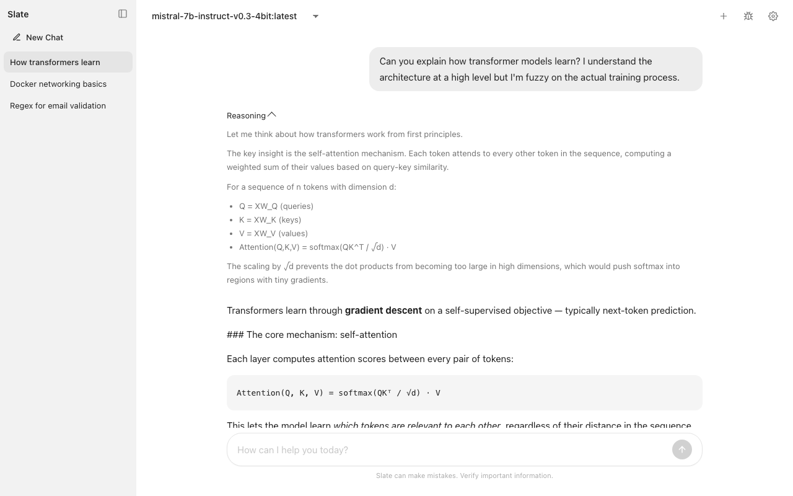
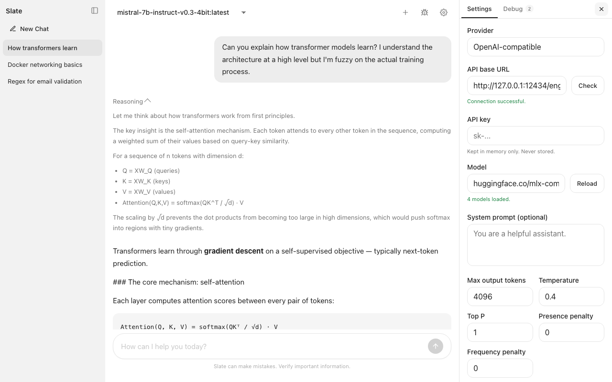

# Slate

A minimal chat UI for OpenAI-compatible APIs, Ollama, and Anthropic. Ships as a single HTML file — open it in any browser, no server or install needed.

<div align="center">

[](LICENSE.md)
[](https://buymeacoffee.com/hansjoakimpersson)

</div>



## Download

[**Slate-latest.html**](https://github.com/HansJoakimPersson/Slate/releases/latest/download/Slate-latest.html) — download and open in your browser.

## Features

- **Single file** — the entire app is one `index.html`. No install, no build step, no CDN.
- **Runs directly in the browser** — just open the file. No server, no Python, no Node.
- **Multiple conversations** — sidebar with history, auto-generated titles, and inline rename.
- **Streaming responses** — real-time token streaming with Markdown rendering.
- **Thinking models** — collapsible reasoning blocks with live spinner for models that expose chain-of-thought (Qwen3, DeepSeek-R1, etc.).
- **Three providers** — OpenAI-compatible endpoints (Docker Model Runner, LM Studio, etc.), Ollama, and Anthropic Claude.
- **Full settings panel** — system prompt, temperature, top-p, max tokens, tools/function calling, and provider-specific parameters.
- **API key never persisted** — the key stays in memory only, cleared on page close.



## Usage

1. [Download `Slate-latest.html`](https://github.com/HansJoakimPersson/Slate/releases/latest/download/Slate-latest.html)
2. Open it in your browser
3. Click the settings icon, set your API base URL and model, and start chatting

No server required. Works with any browser that supports `fetch` and `EventSource`.

## Development

The default API endpoint is `http://127.0.0.1:12434/engines/v1` (Docker Model Runner). To use a different backend, change the **API Base URL** in settings — for example `http://localhost:11434` for Ollama or `https://api.openai.com/v1` for OpenAI.

To run the test suite:

```bash
npm install
npm run test:e2e
```

Tests use Playwright and mock all network requests — no live backend needed.

## Support

If you want to support this project:

- [Buy Me a Coffee](https://buymeacoffee.com/hansjoakimpersson)

## License

Slate is licensed under `AGPL-3.0-only`. See [LICENSE.md](LICENSE.md).
